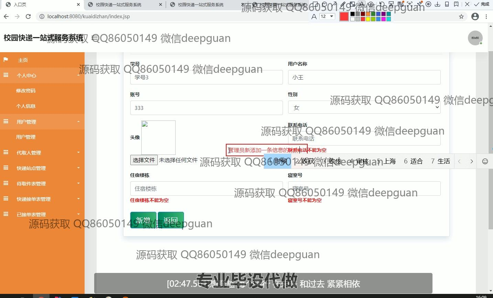

<h1 align="center">校园快递一站式服务系统</h1>

## 简介
校园快递一站式服务系统：角色分为管理员、代理人和用户；提供用户管理、快递管理、密码修改、订单处理和信息查询功能，简化校园快递管理流程，提高效率与用户体验。    --计算机毕业设计源码；毕设源码；java毕业设计源码

## 联系方式

<h3 align="center">获取完整代码与数据库文件 + 微信：deepguan QQ: 86050149 QQ群: 783742310</h3>

<h3 align="center">可帮忙远程部署 包运行成功！提供远程部署、修改代码、设计文档指导、代码讲解等服务！</h3>

## 功能介绍（完整见运行截图）
管理员：管理员可登录系统，管理用户信息，包括新增、修改、删除用户，查看快递订单及其状态，管理快递站点信息，处理待取件和已接单表的记录，并可通过筛选功能快速查找特定订单。管理员还可设置代理人账户，管理其权限及操作记录，确保快递服务高效运行。

代理人：代理人可通过登录身份查看分配的订单信息，包括快递名称、发布人、收件人、联系电话等。可在系统中接单并确认到达，管理待取件列表和代取记录，支持通过筛选条件快速定位相关订单，提高工作效率。

普通用户：用户可注册和登录系统，在个人中心查看和修改个人信息，包括学号、用户名、宿舍地址等，并上传头像。用户可查询快递信息，发布代取请求，管理自己的快递订单，包括查看待取件和已接单列表，方便完成快递操作。

访客：访客可访问系统的入口页，浏览系统的基本功能和页面结构，但无法进行与快递相关的操作，需注册登录后使用系统的完整功能。

## 运行截图

本代码来源于网络,仅供学习参考使用!

